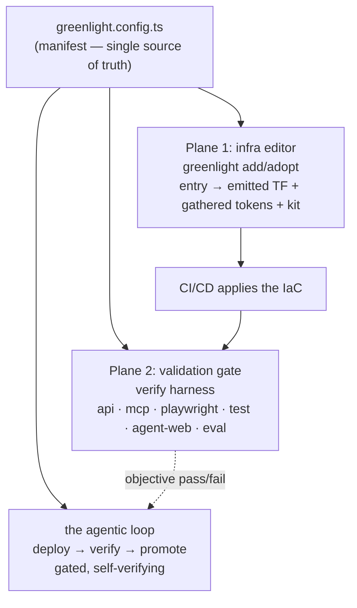

# Greenlight — Architecture (as built)

> The canonical description of how Greenlight works today. For the *why* and the original narrowed
> scope see [greenlight-v2.md](../greenlight-v2.md) (the spec); for how to work in the repo see
> [development.md](development.md). The per-phase build plans that got us here are archived under
> [archive/](archive/) — this doc supersedes them for the current state.

## What Greenlight is

Greenlight turns a domain + API tokens into a live personal site plus a self-verifying agentic
deploy loop, with plug-and-play subdomain tools that are **either web apps or MCP servers**. It is
provider-agnostic and explicitly **not** a hosted PaaS or control plane — it orchestrates existing
free-tier providers through files you own.

**The consumer model is install-the-CLI, not fork-the-repo.** Greenlight ships as one published npm
package (the CLI, libs bundled) + git-tagged Terraform modules + a Claude Code plugin. `greenlight
init` scaffolds a **thin wrapper repo you own** — your manifest + content — that depends on the
package and updates via `pnpm update`. You own your wrapper (no lock-in, MIT); you never merge
framework code. The CLI **edits** declarative infrastructure-as-code; **CI/CD applies it** — nothing
in Greenlight runs `terraform apply` or deploys on your behalf. (New wrapper? see
[getting-started.md](getting-started.md).)

It was extracted from two real, already-built tools that kept timing out — **BAMCP** (a stateful MCP
server on OCI) and **HeistMind** (Next.js + Supabase on Vercel) — so the design is an extraction, not
speculation. The whole point is to make those stay alive on their own and make (re)wiring declarative.

## The mental model: one spine, two planes

Everything hangs off a single spine — **the manifest + the CLI + the agent kit** — exposed as two
related planes:



<details><summary>same diagram as ASCII (fallback)</summary>

```
                         greenlight.config.ts  (the manifest — single source of truth)
                                      │
        ┌─────────────────────────────┼─────────────────────────────┐
        ▼                             ▼                             ▼
  Plane 1: infra editor        the agentic loop          Plane 2: validation gate
  (greenlight add/adopt)       (deploy→verify→promote)   (the verify harness)
  one entry → emitted TF       gated, self-verifying      api|mcp|playwright|
  + gathered tokens            ships with confidence      test|agent-web|eval
  + wired kit                                             (combine via array)
        │                                                          ▲
        └──────────────── CI/CD applies the IaC ───────────────────┘
```

</details>

- **Plane 1 — the infra editor.** `greenlight add`/`adopt` is a one-stop declarative IaC editor: one
  manifest entry → emitted Terraform + gathered/verified tokens + a wired agent kit. It edits IaC and
  never applies.
- **Plane 2 — the validation gate.** One `verify(baseUrl, spec)` harness, six modes, wired to
  *promotion* (not just test-writing). The same code CI and the agent run.

## The manifest — the single source of truth

[`greenlight.config.ts`](../greenlight-v2.md) (`defineConfig`, schema in
[`packages/shared`](../packages/shared)) lists the domain, the blog, and every tool with its facets:

```ts
{ lane, target, data, auth, access, envs }
```

The CLI **and** Terraform are both driven by it. Adding a tool is one manifest entry + a scoped
apply. Keeping manifest ↔ tool dir ↔ workflow consistent is one of `doctor`'s checks.

## Two orthogonal axes: `lane` × `target`

- **`lane`** = what the tool *is*: `astro | hono | next | mcp | docker` (V1 builds `astro`, `next`,
  `mcp`).
- **`target`** = where it *runs*: `workers | vercel | oci` (V1's three).

| lane | default target | typical data | verify mode |
|---|---|---|---|
| `astro` (blog) | `workers` | `none`/`d1`/`kv` (never Supabase) | `api` |
| `next` | `vercel` | `supabase` (when bundled auth/storage needed) | `test` + `agent-web` |
| `mcp` | `workers` (dev) / `oci` (stateful prod) | `none` | `mcp` (+ `eval`) |

The blog must **never** use Supabase for state (Supabase pauses; the blog must stay up unattended).

## The deploy-target adapter contract

The product is the contract; frameworks are swappable. Every target
([`packages/adapters`](../packages/adapters)) implements the same four hooks:

- `build()`
- `deploy(toolDir, env) -> { url }`
- `url(toolName, env) -> string` — **deterministic**, so verification targets it without scraping logs
- `teardown()`

Switching a tool between Workers / Vercel / OCI is config, not a rewrite.

## The verify harness

[`packages/verify`](../packages/verify) exposes one `verify(baseUrl, spec) -> { pass, report }`.
`spec.mode ∈`:

| mode | what it proves |
|---|---|
| `api` | URL smoke / status + shape |
| `mcp` | MCP protocol: initialize → `tools/list` → call a tool & assert shape → assert auth rejection |
| `playwright` | a11y-tree render smoke (`renders`) **and/or** a real Playwright suite (`suite`) run against the deploy URL (injected as `PLAYWRIGHT_BASE_URL`/`GREENLIGHT_VERIFY_URL`), gated on exit code |
| `test` | the tool's own test command (gate on exit code) |
| `agent-web` | an LLM drives the live UI via Playwright to do a task, then assertions confirm |
| `eval` | an LLM judge scores an MCP tool result against a rubric (**0..1**; `minScore` default 0.8) |

A `verify.config.ts` may export an **array** to combine modes (`verifyAll` / `allPass`). `agent-web`
and `eval` lazy-load optional deps (`playwright`, `@anthropic-ai/sdk`) and **degrade to a failing
check — never a throw** — without the dep or `ANTHROPIC_API_KEY`. **CI and the agent loop call the
same harness**, which is what wires verification to promotion.

`greenlight verify <name> --json` (or `GREENLIGHT_VERIFY_JSON=1`) emits the result as one
standards-shaped (OTel-GenAI / OpenInference) JSON object to **stdout** (human report to **stderr**) —
backend-agnostic, for an eval dashboard, Langfuse, Phoenix, or any OTLP consumer.

## The agentic loop — deploy → verify → promote

Changes to a tool or the blog ship through one gated loop (the
[deploy-verify-promote skill](../.claude/skills/deploy-verify-promote/SKILL.md)):

```
write change ─▶ preview ─▶ VERIFY ─▶ develop/beta ─▶ VERIFY ─▶ promote ─▶ prod ─▶ VERIFY
                (skills guide)  (signal)               (signal)   (gated)         (signal)
```

- **Three git-mapped environments**, branches standardized to **`main` / `develop`**: PR → ephemeral
  preview; `develop` → beta (`beta.<name>.<domain>`, behind Cloudflare Access); `main` → prod.
- **`promote`** is an explicit `workflow_dispatch` fast-forward `develop → main`, gated on beta
  verify passing.
- The loop is distributed as a curated **agent kit** — the loop skill + per-provider skills + MCP
  servers + best-practice skills — not just one skill. See [agentic-loop.md](agentic-loop.md).

## Plane 1 — the infra editor

### Provider-pack registry

[`cli/src/providers.ts`](../cli/src/providers.ts) declares one `ProviderPack` per provider with
everything onboarding needs in one place: tokens (+ scopes + a fail-fast `verify()`), the
deep-guide pointer, MCP server(s), the agent skill, and the Terraform module(s) it references. Adding
a new free-tier backend = write one pack. Six live packs:

| pack | applies when | Terraform modules |
|---|---|---|
| **cloudflare** | always (zone/DNS + Workers) | `tool`, `keepalive` |
| **hcp** | always (remote state) | — |
| **github** | always (secrets + repo/branch) | `repo` |
| **vercel** | `target: vercel` | `vercel` |
| **supabase** | `data: supabase` | `supabase` |
| **oci** | `target: oci` | `tool`, `tunnel`, `oci-network`, `oci-container-instance` |

### `greenlight add` / `init`

[`add.ts`](../cli/src/commands/add.ts) is the editor: manifest entry → emit `infra/<name>.tf` module
blocks ([`tf-emit.ts`](../cli/src/tf-emit.ts)) + scaffold `infra/main.tf` when absent → gather +
fail-fast-verify the providers' tokens → materialize the kit (MCP + per-provider skills + CLAUDE
block). **It edits IaC; it never applies.** Commit + push and CI (`infra.yml`) runs `terraform apply`.

### Secrets — `greenlight secrets gather`

GitHub Actions secrets are the **single** secret store — Greenlight keeps no local secret file.
Tokens are entered once, validated (fail fast), and pushed straight to GitHub
(secrets/environments; Cloudflare/Vercel/Supabase/OCI consumed by CI as Terraform vars at apply
time) — **never written to disk, committed, or echoed**.

- **`secrets gather <tool>`** ([`secrets.ts`](../cli/src/commands/secrets.ts)) — guided, link-first
  onboarding straight to a repo's GitHub secrets: prints each provider's setup link + scopes,
  hidden-prompts for the value, runs `verify()`, and pushes via `gh` with the value on **stdin**
  (never argv/file/log). Also prompts the always-on base tokens (`CLOUDFLARE_API_TOKEN`,
  `TF_API_TOKEN`). Flags which secrets are **already set** (paste overrides, Enter keeps).
  `--oci-config <path>` ingests OCI's API-key config preview + `.pem` to auto-fill the auth values.
- `gh secret set` is the manual alternative for setting/rotating an individual secret.

For a poly-repo (adopted) tool, tokens **split** across the wrapper and the tool sub-repo: provider
creds live only in the wrapper; the tool repo holds exactly one PAT (`GREENLIGHT_DISPATCH_TOKEN`).
The full wrapper↔sub-repo topology + the two option-B PATs are in
[provider-tokens.md](provider-tokens.md#poly-repo-adopted-tool-tokens--wrapper--sub-repo).

Prefer GitHub **OIDC → cloud** over long-lived Actions secrets. `private` tools and all `beta.*` sit
behind Cloudflare Access; mutating/private MCP servers default to `bearer`/`oauth`, never `none`.

### Plane 1b — `adopt` (poly-repo)

[`adopt.ts`](../cli/src/commands/adopt.ts) onboards an existing tool repo two ways:

- **Default (wrapper-centric):** wrap the tool as a `tools/<name>` git submodule, edit its infra in
  the wrapper (`infra/<name>.tf` + `verify/<name>.config.ts`), and push the loop kit **back into the
  tool repo** so it travels with the submodule. Registers an `external` manifest pointer.
- **`--standalone`:** scaffold the full self-contained consumer into the tool repo (merged
  `package.json`, infra, namespaced workflows, verify, kit), app code untouched.

Existing tools are **adopted, not rewritten** (`adopted: true`).

## Data & liveness

- **Data model** (`data ∈ none | d1 | kv | neon | supabase`): V1 ships `none`/`d1`/`kv` (blog) +
  `supabase` (HeistMind). Supabase is project-per-env + a keepalive heartbeat (it pauses after 7
  days idle). Neon (branch-per-env, scale-to-zero) is the V0 default, deferred in V1.
- **Liveness is a feature.** [`packages/keepalive`](../packages/keepalive) is a **Cloudflare Worker
  Cron Trigger** (not GitHub Actions — immune to repo-inactivity auto-disable). It runs cheap queries
  against `data: supabase` DBs, health-checks `target: oci` services, and alerts via `alerts.sink`
  (`github-issue` or Resend `email`) on failure. It ships as a Worker inside its Terraform module.

## The OCI free-tier model (stateful tools)

`target: oci` is the runtime for stateful services that don't fit serverless (the canonical case is
BAMCP). It stays on the **Always-Free** tier — **no PAYG**.

- **Provider-agnostic tool → GHCR.** The tool repo's CI only **builds + pushes a container to GHCR**
  (free). No OCI, no deploy logic — portable. (OCIR, Oracle's own registry, is paid — avoided.)
- **Greenlight owns the OCI infra (all IaC, in the wrapper):**
  - [`oci-network`](../infra/modules/oci-network) — VCN + internet gateway + route + egress-only
    security list + a public subnet. The tunnel is outbound-only, so no ingress.
  - [`oci-container-instance`](../infra/modules/oci-container-instance) — an Ampere **A1 Container
    Instance** (within the Always-Free allotment, restart-policy ALWAYS) running the tool image + a
    **cloudflared sidecar** (shared netns → `localhost:8000`). The **availability domain is
    auto-looked-up** via an `oci_identity_availability_domains` data source.
  - [`tunnel`](../infra/modules/tunnel) — the Cloudflare Tunnel + ingress + connector token.
  - `tool` — the DNS CNAME → the tunnel.
- **The only manual OCI input is the API key.** Terraform can't create the credential it uses to
  authenticate, but it owns everything after that (VCN/subnet/AD/compartment). Compartment defaults
  to the tenancy root.
- **Deploy = restart (re-pull).** `greenlight deploy <tool>` restarts the instance so it re-pulls the
  latest GHCR image; the adapter does not build. An event trigger (a tool-repo build → `repository_dispatch`)
  fires the restart.
- **Idle-reclaim → recover on alert.** If a free instance is ever reclaimed, keepalive's health check
  alerts and a re-apply/redeploy restores it. PAYG is an optional last resort only.
  See [oci-payg-runbook.md](oci-payg-runbook.md).

## The clone seam (two rules CI enforces)

These keep the framework reusable and the consumer thin, without merge-hell:

1. **No personal data in framework files.** Domain/tool-names live only in `greenlight.config.ts`;
   tokens live only in GitHub Actions secrets. `pnpm check-seam` enforces it (docs exempt).
2. **No load-bearing logic outside `packages/*` and `cli/`.** Consumer files only *call* the
   framework. `pnpm check-boundaries` (dependency-cruiser) guards the import direction.

`greenlight init` is the transform from "the baseline" to "someone's setup."

## Distribution & versioning

Three channels, one source of truth per artifact type:

- **npm** — **one published package, `@rtrentjones/greenlight`** (the CLI). It **bundles** the
  framework libs (`shared`/`verify`/`adapters`/`loop`, tsup `noExternal`); those + `keepalive` are
  `private`. `playwright` + `@anthropic-ai/sdk` are optional/external. Publishing is **OIDC Trusted
  Publishing** (`.github/workflows/release.yml`, no `NPM_TOKEN`), triggered by a `v*` tag.
- **git tags** — the Terraform modules, source-ref-pinned via `MODULE_REF`
  ([`cli/src/version.ts`](../cli/src/version.ts)), e.g. `?ref=v0.6.0` (the published version).
- **plugin marketplace** — the skills (`/plugin marketplace add RTrentJones/greenlight`).

**Lockstep:** the npm version, the `MODULE_REF` git tag, and the wrapper's module `?ref=` move
together (e.g. `v0.2.20`). The personal repo is a **thin consumer** that depends on the one package
and updates via `pnpm update` — no merging framework code.

## Repo topology (key dirs)

```
greenlight.config.ts        # the manifest (consumer side)
cli/                        # @rtrentjones/greenlight — the bin + Plane-1 commands + emitters
packages/{shared,verify,adapters,loop,keepalive}   # bundled into the CLI (private)
infra/modules/*             # git-sourced Terraform: tool, tunnel, oci-network,
                            #   oci-container-instance, supabase, vercel, repo, keepalive
.claude/skills/*            # loop skill + per-provider skills (mirrored to plugin/ + cli/assets/)
plugin/                     # the Claude Code plugin (skills + marketplace)
tools/_template-*           # lane templates
.github/workflows/          # release.yml (publish), infra.yml + CI live in the consumer
docs/                       # this doc, development, runbook, provider-tokens, archive/
```

## Where to go next

- **[getting-started.md](getting-started.md)** — stand up a new wrapper (init → add+gather → push → verify).
- **[demo.md](demo.md)** — try it cold in ~3 min, no cloud credentials.
- **[security.md](security.md)** — secrets, trust boundaries, token topology, supply chain.
- **[greenlight-v2.md](../greenlight-v2.md)** — the executable spec (the *why* + V1 scope + identity).
- **[development.md](development.md)** — toolchain, commands, build model, how to work in the repo.
- **[agentic-loop.md](agentic-loop.md)** — the agent kit (skills + MCP + best practices).
- **[oci-payg-runbook.md](oci-payg-runbook.md)** — the OCI free-tier runbook.
- **[provider-tokens.md](provider-tokens.md)** / **[terraform-state.md](terraform-state.md)** —
  the token + remote-state deep guides.
- **[archive/](archive/)** — the per-phase build plans (historical record).
