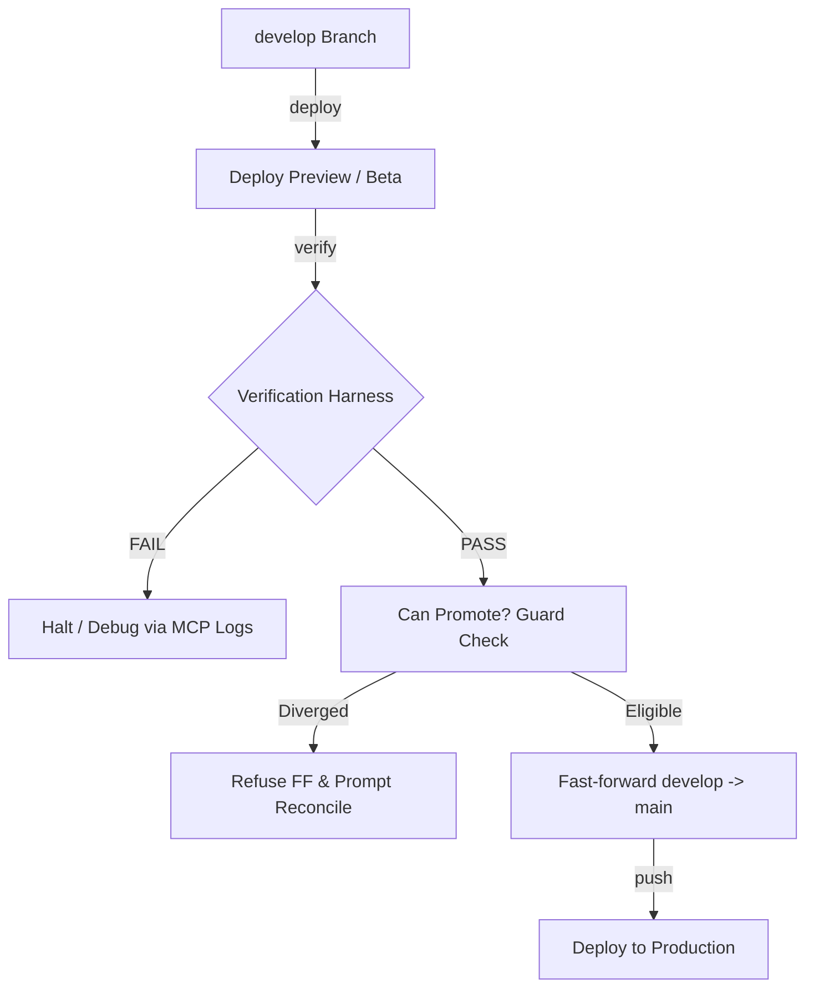

# Greenlight Project Deep Review

Greenlight is a clone-and-own framework designed to run a self-verifying, provider-agnostic deploy-and-promote loop for personal sites and subdomain services (either web apps or MCP servers). It separates core framework operations from user content and configurations, allowing seamless upgrades without merge conflicts.

---

## 1. Project Status & Deliverables

The Greenlight codebase is highly complete, exceeding the baseline expectations:
- **Phases 0–7 (Core Framework & CLI)** are fully implemented and locally verified.
- **Phase 8 (Keepalive worker + cron IaC)** is fully implemented, unit-tested, and integrated into `doctor`.
- **Phase 9 (Adoption workflow)** is partially implemented. The `adopt` CLI command is functional, and the wrapper-side Terraform modules/configurations for **HeistMind** (Next.js + Supabase on Vercel) have been scaffolded.
- **Verification & Quality Checks:** All checks (`pnpm run check-all`) pass successfully, verifying that all 13 test suites (67 tests) are green, the Biome linting has no warnings, the seam check (personal data leak prevention) is clean, and dependency-cruiser boundary rules are respected.

---

## 2. Core Concepts & Architectural Review

### 2.1 The Seam & Personal-Repo Model
The framework separates generic code from personal identity via two strict rules enforced in CI:
1. **No Personal Data in Framework Files:** Hardcoding domains, emails, or tokens in the CLI or packages is prohibited. `check-seam.ts` scans all files at build/commit time and blocks leaks.
2. **Unidirectional Imports:** Consumer files only call the framework. `dependency-cruiser` blocks framework code from importing consumer internals.

The personal repository (e.g. `RTrentJones.dev`) is a **thin consumer** containing only content, configuration, and a `package.json` pointing to published packages or local tarballs.

### 2.2 The Manifest as the Single Source of Truth
The `greenlight.config.ts` configuration lists the domain, optional blog, and active tools. Zod schemas validate the lane-target-data matrix at load time:
```ts
export const ToolSchema = z.object({
  name: z.string(),
  lane: LaneEnum,      // 'astro' | 'next' | 'mcp'
  target: TargetEnum,  // 'workers' | 'vercel' | 'oci'
  data: DataEnum,      // 'none' | 'd1' | 'kv' | 'supabase'
  auth: AuthEnum,
  external: z.boolean().default(false),
  adopted: z.boolean().default(false),
  dir: z.string().optional()
}).superRefine(...) // Enforces valid matrix configurations (e.g., next -> vercel; mcp -> oci/workers)
```

---

## 3. Detailed Component Review

### 3.1 The Gated Loop (deploy → verify → promote)
The centerpiece of the workflow is automated promotion gating:
- **Deployment:** The `@rtrentjones/greenlight-adapters` package maps targets to adapters. Currently, the `workers` adapter builds Astro sites and deploys them via Wrangler. `vercel` and `oci` are stubs since they rely on external triggers (Vercel git-integration) or upcoming features (OCI Docker builds).
- **Verification (`packages/verify`):**
  - **API Mode:** Resolves 200 statuses, checks XML formats for RSS/Sitemaps, and crawls up to 25 internal links to verify no broken routes.
  - **MCP Mode:** Performs a protocol-level check. It starts an initialize handshake, calls `tools/list` to match expected tools, triggers a test `tools/call`, and asserts that unauthenticated calls are rejected with 401/403 errors.
  - **Playwright Mode:** Checks browser rendering by extracting the page's accessibility tree and verifying it is non-empty. Playwright is dynamically imported and set as an `optionalDependency`, preventing API/MCP users from having to download browser engines.
- **Promotion (`packages/loop`):**
  - Uses Git ancestry checks (`git merge-base --is-ancestor main develop`) to ensure `main` can be safely fast-forwarded to `develop`.
  - Refuses to merge if `main` has diverged (e.g., from a direct hotfix), prompting the user with a rebase/merge resolution guide.



### 3.2 Liveness & Keepalive (`packages/keepalive`)
Supabase projects on the free tier pause after 7 days of inactivity. To resolve this, Greenlight includes an edge worker that operates as a Cloudflare Worker Cron Trigger (bypassing GitHub's scheduled workflow timeout rules):
- **Probes:** Supports both `supabase` (performs a REST check using the Anon Key to register DB activity) and `oci` (runs a plain HTTP health check).
- **Alerting:** If any health pings fail, it issues a POST request to the GitHub API, creating an issue in the designated repository (serving as the default zero-dependency alert sink).

### 3.3 Poly-Repo & Adoption Flow
The `greenlight adopt` command permits integrating existing tools:
- It leaves the tool's application logic untouched.
- It inserts a `greenlight.config.ts` (with `dir: "."` and `adopted: true`), merges dependencies and pnpm overrides, copies bootstrap tarballs, copies IaC (`infra/main.tf` using git module references), and materializes GHA workflows.
- It registers the adopted repo in the central site repository manifest as an `external: true` pointer.

---

## 4. Key Findings & Recommendations

### 4.1 Development Out-of-Sync Tarballs
> [!IMPORTANT]
> **Observation:** Running `greenlight doctor` inside the `RTrentJones.dev` consumer workspace failed because it was looking for the directory `tools/heistmind`, even though it was configured with `external: true` (which should skip directory checks).
>
> **Root Cause:** The consumer repo dependencies were locked to `file:vendor/rtrentjones-greenlight-0.1.0.tgz`. This tarball was compiled and copied to the folder *before* the `external: true` check was added to the CLI code. Because the local packages are installed from tarballs, pnpm caching and manual copying make it easy for the developer's consumer repo to slip out of sync with framework updates.

**Recommendation:**
Create a dev-sync script inside the framework's workspace root to rebuild packages, repack them, and copy them directly to sibling consumer folders:
```json
// Add to greenlight root package.json
"scripts": {
  "sync:consumer": "pnpm build:packages && cd cli && pnpm pack && mv *.tgz ../../RTrentJones.dev/vendor/ && cd ../packages/shared && pnpm pack && mv *.tgz ../../../RTrentJones.dev/vendor/ && ... && cd ../../RTrentJones.dev && pnpm install"
}
```

### 4.2 Lacking Git Cleanliness Guard in Promotion
> [!WARNING]
> The `promote(repoDir)` command checks out `main` and merges `develop`:
> ```ts
> git(repoDir, ['checkout', to]);
> git(repoDir, ['merge', '--ff-only', from]);
> ```
> If the user runs `greenlight promote --perform` locally while they have uncommitted work, Git will attempt to carry those changes into the checkout, which could result in conflicts, accidental commits, or merge blockages.

**Recommendation:**
Integrate a clean check in `canPromote` using `git status --porcelain` to verify the working directory is clean before checking out branches.

### 4.3 OCI Adapter Lifecycle & Tunneled Deployments
> [!NOTE]
> The OCI target expects Docker behind a Cloudflare Tunnel. Currently, the `oci` target uses a `skeletonAdapter` which throws errors on `build` and `deploy`.

**Recommendation:**
In the next phase (Phase 9b), implement the OCI adapter:
1. **Build:** Build a local Docker image from the tool's `Dockerfile`.
2. **Deploy:** Push the Docker image to Oracle Cloud Infrastructure Registry (OCIR) and trigger a remote deploy script, or deploy it locally to the target instance and map ingress to `cloudflared`.

---

## 5. Summary
The Greenlight project is beautifully engineered. The boundary checks and seam enforcement ensure that the framework stays modular and upgradeable. Resolving the out-of-sync local tarballs and adding dirty-checks to the promotion CLI will elevate the project to production-grade stability.
