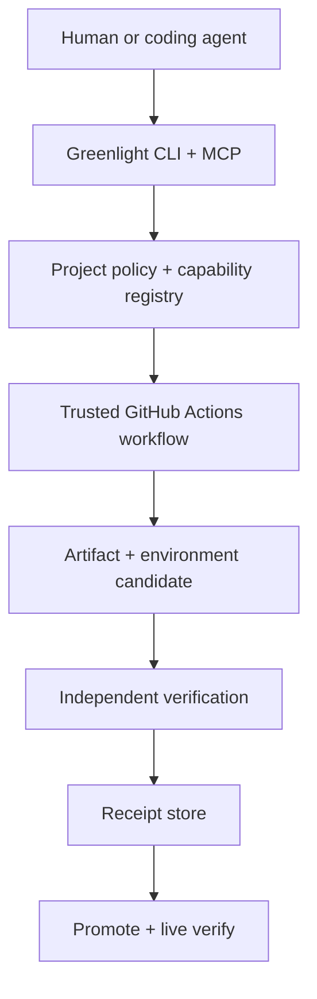

# Greenlight V3 — an agent-confident delivery system for personal software

**Status:** Proposed  
**Primary dogfood repository:** [`RTrentJones/RTrentJones.dev`](https://github.com/RTrentJones/RTrentJones.dev)  
**Scope rule:** Cloudflare and the existing personal-site workflow are the P0/P1 golden path. SST,
new deployment targets, and generalized multi-provider support are P2.

## 1. Summary

Greenlight V3 centralizes the contract, policy, and evidence needed to let a coding agent change or
create personal software with confidence. It does not centralize source repositories, replace
GitHub Actions, or become another agent host.

The first outcome is intentionally narrow:

> From Codex or Claude, change `RTrentJones.dev` or create a small tool beneath its domain; have
> Greenlight build an immutable artifact, deploy it to a permanent beta environment, independently
> verify the deployed result, and promote only an equally verified production deployment of that
> artifact.

The second outcome extends the same loop to agent-created tools:

> Given “create a static page at `status.rtrentjones.dev`” or “create an MCP app for inspecting my
> releases,” the agent selects from a constrained capability registry, proposes source and
> infrastructure changes, provisions only within policy, deploys a coherent release to beta, and
> returns the URL plus machine-readable evidence.

V3 retains the strongest pieces of the current system—verification modes, provider knowledge,
Terraform/OpenTofu output, `doctor`, secret scoping, permanent beta, and GitHub Actions as the trust
boundary—but replaces the lane matrix and branch-as-deployment model with explicit artifacts,
deployments, environments, release groups, policies, and receipts.

## 2. Why redesign

Greenlight today successfully provides a thin wrapper, generated Terraform and workflows, six
verification modes, and a `develop -> beta -> main -> prod` loop. It is already useful, but four
properties prevent it from being the confidence layer for open-ended agent work:

1. **Artifact identity is optional.** A tool without `/__version` can pass as “sha unverified.”
2. **The domain model mixes concerns.** `lane x target x data` conflates framework, surface,
   runtime, and dependency choices; `polyphony` already has to identify as `mcp` only to reach OCI.
3. **Promotion is source-oriented.** The verified beta commit is fast-forwarded, then production is
   rebuilt/deployed. The system does not model the build artifact and environment-specific provider
   deployment as separate immutable subjects.
4. **Provisioning is command-shaped rather than plan-shaped.** `add` can scaffold known cells, but
   an agent cannot ask what combinations are supported, propose a typed application graph, explain
   the resulting changes, and receive a policy decision before anything is applied.

The redesign should solve these in the service of real dogfooding. Provider breadth is not a P0
measure of success.

## 3. Goals

### P0/P1 goals

- Make permanent `beta` and `production` first-class, configurable environments.
- Make identity mandatory for every gated deployment; remove “sha unverified” as a passing state.
- Build once and bind all evidence to the immutable artifact and environment-specific deployment.
- Run deterministic verification outside the coding agent and produce a durable receipt.
- Make the same project policy discoverable by Codex, Claude, a human CLI session, and CI.
- Support safe, agent-created Cloudflare static sites, Workers APIs/MCP servers, KV, and D1.
- Support multi-component release groups whose compatible versions advance together.
- Preserve readable IaC and the rule: the CLI edits/plans; trusted CI applies.
- Keep a migration path for current `RTrentJones.dev`, HeistMind, BAMCP, Tracer, Muse, and Polyphony.

### Engineering-quality goals

- Put invariants and failure semantics in types and contract tests, not only in agent instructions.
- Make every mutation previewable and every release explainable after the fact.
- Test adapters against a shared conformance suite and exercise the live golden path on a canary.
- Prefer a small trustworthy kernel with one excellent provider path over a broad matrix of partial
  adapters.

## 4. Non-goals before P2

- SST as a provisioning backend.
- New or generalized Vercel, OCI, Docker, AWS, Supabase, or Neon implementations. Existing V2 paths
  remain in compatibility mode; bringing them onto V3 contracts is P2.
- A hosted control plane, custom workflow scheduler, or secret store.
- A multi-agent orchestrator, Codex/Claude delegation runtime, or session dashboard.
- A general PaaS or a promise that arbitrary cloud resources can be assembled safely.
- A requirement that all checks run in Dagger. Dagger is evaluated in P1 behind a runner contract.
- LLM judgments as the only gate for a production release.
- Globally atomic cross-provider promotion. Greenlight will provide ordered promotion and
  compensating rollback, and will report partial failure honestly.

## 5. Design principles and hard invariants

1. **The deployed subject, not an agent claim, is the evidence boundary.** Greenlight performs the
   gate in a trusted process after the agent has finished writing code.
2. **Build once.** Promotion never recompiles source. If an environment needs a distinct provider
   deployment, it is materialized from the exact artifact digest that passed earlier gates.
3. **Every routed deployment was verified.** A production URL may point only to a deployment with a
   passing receipt for the current policy digest.
4. **Beta is permanent when configured.** It is an environment, not merely a transient candidate.
   Ephemeral PR previews may coexist with it.
5. **Configuration is part of identity.** A deployment binds an artifact digest, environment,
   provider version, and non-secret configuration digest. Production still receives its own
   candidate verification because beta and production bindings can differ.
6. **A release group is the unit of compatibility.** All members are prepared and verified before
   any member is promoted. Partial promotion triggers compensating rollback and a `degraded` result.
7. **Agents propose; policy and trusted CI authorize.** Agents receive no production credentials and
   cannot directly call `terraform apply`, route production traffic, or bypass a failed check.
8. **Unsupported is a valid answer.** The planner returns an explainable rejection rather than
   improvising an unmodeled provider combination.
9. **Deterministic checks are authoritative.** Agent browsing and LLM evals are advisory unless a
   project explicitly opts into them as additional required signals.
10. **No big-bang migration.** V2 and V3 descriptors can coexist until each project has passed the
    V3 conformance suite.

## 6. User journeys

### 6.1 Change the personal site

1. The user asks Codex or Claude to change the site.
2. The agent reads `AGENTS.md` and the canonical Greenlight skill, inspects project policy, and runs
   `greenlight preflight site`.
3. A pull request runs source checks and publishes screenshots/check evidence.
4. A merge to the configured beta source builds one artifact, uploads a version-specific
   Cloudflare candidate, verifies it, and routes the permanent beta environment to it.
5. `greenlight release inspect <id>` reports artifact identity, policy, checks, URLs, and evidence.
6. A manual promotion request materializes a production candidate from the same artifact without
   rebuilding, verifies its version-specific URL, routes production, performs live smoke checks,
   and records the result. On live failure, the previous production version is restored.

### 6.2 Create a static subdomain prototype

For “create a static page at `status.rtrentjones.dev`”:

1. The agent calls `greenlight capabilities list` and selects the approved `static-site/workers`
   capability.
2. `greenlight plan` produces a typed `ToolPlan`, source scaffold, manifest update, verification
   policy, DNS/Worker IaC changes, and an impact summary.
3. Trusted CI runs an OpenTofu/Terraform plan and classifies it. An additive, beta-only, zero-cost
   plan may auto-apply when the repository enables `autonomous-beta`; otherwise it waits for review.
4. The resulting beta deployment is independently verified. The agent receives the URL and receipt,
   not raw provider credentials.
5. Production infrastructure and routing always require explicit promotion approval.

### 6.3 Create a frontend + MCP/API tool

For “create an MCP app for inspecting Greenlight releases,” the agent may select:

- a static frontend,
- a Worker API/MCP surface,
- D1 or KV when state is required,
- an auth capability only when the approved registry supports it.

Greenlight validates the component graph and deploys it as one release group. The frontend and
backend candidates must both pass their relevant checks before beta advances. Production promotion
is ordered and compensating rather than falsely described as atomic.

## 7. Architecture



Greenlight is a local package and a set of pinned reusable GitHub workflows. There is no always-on
Greenlight service in the release path.

### 7.1 Ownership boundaries

| Concern | Owner |
|---|---|
| Intent, source changes, repair | Human, Codex, or Claude |
| Supported component vocabulary and plan validation | Greenlight |
| Source, environment, release-group, and verification policy | Project repository |
| Build/test execution | `Runner` (`ProcessRunner` first; Dagger evaluated in P1) |
| Infrastructure source | Project-owned OpenTofu/Terraform |
| Credentials, approvals, mutations | GitHub Actions environments and OIDC/scoped secrets |
| Artifact upload, routing, rollback | Provider driver |
| Gate result and promotion authorization | Greenlight receipt policy |
| Status UI/read model | GitHub Checks initially; Tracer may ingest events but is not authoritative |

### 7.2 Project descriptor

The descriptor separates surfaces, targets, dependencies, environments, and policy:

```ts
export default defineProject({
  id: 'rtrentjones-dev',
  domain: 'rtrentjones.dev',

  components: {
    site: staticSite({
      source: 'apps/blog',
      surface: web(),
      target: workers({ service: 'rtrentjones-dev' }),
    }),
  },

  environments: {
    beta: persistent({
      source: branch('develop'),
      domain: 'beta.rtrentjones.dev',
      update: 'automatic',
    }),
    production: persistent({
      domain: 'rtrentjones.dev',
      update: 'manual-promotion',
    }),
  },

  releaseGroups: {
    site: releaseGroup(['site']),
  },

  policy: standardPersonalSite(),
});
```

Branch triggers are configuration, not the identity of an environment. A project may use ephemeral
previews, permanent beta, production, or any supported combination. Permanent beta is the default
for V3-generated projects.

### 7.3 Domain model

```ts
interface ArtifactRef {
  digest: `sha256:${string}`;
  sourceSha: string;
  builder: { id: string; version: string };
  outputs: Array<{ name: string; mediaType: string; digest: string }>;
}

interface DeploymentRef {
  component: string;
  environment: string;
  artifact: ArtifactRef;
  provider: string;
  subject: { kind: string; id: string; digest?: string };
  url: string;
  configurationDigest: string;
}

interface Release {
  id: string;
  group: string;
  sourceSha: string;
  deployments: DeploymentRef[];
  previousDeployments: DeploymentRef[];
  state: 'planned' | 'prepared' | 'verified' | 'promoting' | 'live' | 'failed' | 'degraded';
}

interface VerificationReceipt {
  schemaVersion: '1';
  releaseId: string;
  deploymentDigest: string;
  artifactDigest: string;
  policyDigest: string;
  verifier: { id: string; version: string };
  checks: CheckEvidence[];
  passed: boolean;
  issuedAt: string;
  expiresAt?: string;
  workflowRunUrl: string;
}
```

The split between `ArtifactRef` and `DeploymentRef` is deliberate. A Cloudflare beta service and
production service can produce different provider version IDs because their bindings differ, even
when they use the same build output. Greenlight therefore promises **the same immutable artifact,
no rebuild, plus separate verification of each environment-specific deployment**. A target that
can route the exact same provider deployment may advertise that stronger capability.

### 7.4 Provider contract

```ts
interface TargetDriver {
  id: string;
  capabilities(): {
    promotion: 'route-existing' | 'materialize-artifact';
    candidateUrl: boolean;
    immutableArtifact: boolean;
    rollback: 'pointer' | 'compensating' | 'unavailable';
  };

  build(input: BuildInput): Promise<ArtifactRef>;
  prepare(input: PrepareInput): Promise<DeploymentRef>;
  inspect(ref: DeploymentRef): Promise<ObservedIdentity>;
  route(ref: DeploymentRef): Promise<ProductionRef>;
  inspectLive(ref: ProductionRef): Promise<ObservedIdentity>;
  rollback(previous: ProductionRef): Promise<RollbackResult>;
}
```

P0 implements only the Cloudflare Workers contract and a fake driver used by tests. V2 adapters
remain available through a compatibility shim but do not satisfy V3 promotion guarantees.

### 7.5 Verification policy

Checks run in four scopes:

| Scope | Purpose | Typical checks |
|---|---|---|
| `preflight` | Fast feedback before pushing | format, lint, typecheck, unit tests, build |
| `candidate` | Prove a version-specific deployment | identity, link crawl, API/MCP protocol, Playwright, accessibility |
| `promotion` | Revalidate authorization | receipt, policy digest, candidate existence, approval, freshness |
| `live` | Prove routing and basic behavior | identity, critical smoke, rollback trigger |

The personal-site default profile requires deterministic build, identity, internal-link, rendered
page, and accessibility checks. It uploads browser screenshots and traces as evidence. Performance
budgets and visual/LLM review begin as advisory signals so noisy judgments cannot silently block or
approve production.

`policyDigest` is computed from canonicalized verification configuration, referenced fixtures, and
the verifier version. A receipt is stale when the policy changes or its explicit time-to-live
expires.

### 7.6 Receipt storage and promotion

P0 uses a `ReceiptStore` interface with:

- a local filesystem implementation for development;
- a GitHub Actions artifact implementation for CI, retained longer than the configured receipt TTL;
- one GitHub Check summary linking to the candidate, checks, evidence, and workflow.

A separate promotion workflow fetches by `releaseId` and validates the receipt. Missing or expired
evidence causes re-verification, never a bypass. An OCI/in-toto attestation store can be added in P2
without changing the receipt schema.

Promotion for a release group follows a prepare/commit/compensate sequence:

1. Prepare every environment-specific deployment from immutable artifacts.
2. Verify every prepared deployment and persist receipts.
3. Capture every currently routed production reference.
4. Route components in declared order.
5. Run live checks for the complete group.
6. On failure, restore captured references in reverse order.
7. Return `degraded` when compensation is incomplete and emit an actionable incident record.

This is not distributed atomicity; the state machine makes that limitation explicit.

### 7.7 Agent interface and trust boundary

Greenlight ships the same canonical instructions to both clients:

- top-level `AGENTS.md` and `.agents/skills/**` for Codex;
- `CLAUDE.md` and `.claude/skills/**` for Claude;
- generated consumer assets from one neutral source with a sync check.

The CLI and MCP server expose bounded operations:

```text
project_inspect
capabilities_list
plan_validate
preflight_run
release_request
release_status
evidence_get
promotion_request
```

Mutation tools dispatch trusted workflows; they do not hand provider credentials to the model. MCP
responses are structured and include repairable failures. Cross-agent delegation is outside V3's
release kernel.

### 7.8 Provisioning planner

P1 introduces a versioned capability registry rather than allowing arbitrary cloud-resource plans:

```ts
staticSite({ targets: ['cloudflare-workers'], features: ['custom-domain', 'permanent-beta'] });
workerApi({ targets: ['cloudflare-workers'], data: ['none', 'kv', 'd1'] });
mcpServer({ targets: ['cloudflare-workers'], transport: ['streamable-http'] });
```

An agent submits a `ToolPlan`; Greenlight validates names, connections, auth posture, environment
support, estimated cost class, and provisioner coverage. The resulting `ChangeSet` contains:

- source/scaffold changes;
- project descriptor and verification-policy changes;
- readable IaC changes;
- required secret names and scopes, never values;
- expected resources, domains, and release groups;
- risk classification and unsupported decisions.

`autonomous-beta` is an opt-in policy, not a blanket permission. CI may automatically apply the
exact reviewed plan only when it is additive, beta-scoped, uses approved resource kinds, introduces
no new secret material, contains no destroy/replace action, and remains in the configured cost
class. Production infrastructure always requires explicit approval.

## 8. Phased implementation

### P0 — a trustworthy `RTrentJones.dev` site loop

**Outcome:** routine site changes can be authored by either agent, deployed to permanent beta, and
promoted with artifact- and policy-bound evidence.

Suggested pull-request slices:

1. **Domain kernel and compatibility boundary**
   - Add `ArtifactRef`, `DeploymentRef`, `Release`, `VerificationReceipt`, canonical digests, and the
     release state machine in a dependency-light package.
   - Define `TargetDriver`, `Runner`, and `ReceiptStore` contracts.
   - Adapt current verification results into `CheckEvidence` without rewriting the six modes.
   - Mark V2 adapters as compatibility-only; do not widen their interfaces ad hoc.

2. **Agent-neutral repository assets**
   - Make neutral agent assets canonical and generate Codex and Claude mirrors.
   - Add `AGENTS.md`, `.agents/skills`, and the Codex plugin manifest.
   - Extend `doctor` and the sync check to cover both clients.

3. **Cloudflare immutable candidate driver**
   - Build once, hash outputs, upload a version without routing it, and obtain a version-specific
     candidate URL.
   - Inspect provider metadata and fail closed when identity cannot be established.
   - Route a verified version and restore the prior routed version on live-check failure.
   - Resolve with a spike whether Workers Static Assets are faithfully testable at the version URL;
     if not, use a dedicated pre-route canary service while preserving artifact identity.

4. **Receipts and promotion policy**
   - Make `/__version` defense-in-depth rather than the primary identity proof.
   - Add `--json-file` while closing issue #15, canonical policy digests, receipt persistence, and
     `greenlight release inspect`.
   - Reject missing identity, stale policy, expired evidence, mismatched artifact, or mismatched
     deployment.

5. **Reusable workflow and dogfood migration**
   - Publish one pinned reusable workflow instead of generating large workflow copies.
   - Migrate only the `RTrentJones.dev` site first, preserving `develop -> beta` and explicit
     production promotion.
   - Add the personal-site policy profile, screenshots/traces, GitHub Check summary, failure
     injection tests, and rollback rehearsal.

**P0 acceptance criteria**

- Codex and Claude independently discover and execute the same prescribed loop in a clean clone.
- A homepage/content change automatically reaches permanent beta with a passing receipt.
- Promotion performs no rebuild and production is routed only after production-candidate checks.
- Old content at the expected URL, a changed verification policy, or a mismatched provider version
  all fail closed.
- A forced live-check failure restores the previous production version and records the incident.
- No production provider credential is available to the coding-agent process.
- Three consecutive real site changes complete without manual provider-console work.

### P1 — agent-created Cloudflare tools

**Outcome:** an agent can safely create and beta-deploy a static page or a small frontend +
API/MCP tool beneath `rtrentjones.dev` using a constrained, explainable plan.

Suggested pull-request slices:

1. **Component graph and capability registry**
   - Replace new uses of `lane x target x data` with surfaces, runtimes, dependencies, and
     connections.
   - Ship only the Cloudflare capabilities needed by the two reference journeys.
   - Add JSON Schema output so an agent can reliably construct and repair `ToolPlan` objects.

2. **Plan/apply separation**
   - Generate a `ChangeSet` and readable OpenTofu/Terraform.
   - Evaluate plan JSON against additive-beta policy.
   - Apply the exact plan only in trusted CI; record resources and outputs back into release state.

3. **Static-page tracer bullet**
   - Implement “create `<name>.rtrentjones.dev` as a static page.”
   - Scaffold source, verification, permanent beta/prod environments, DNS, and Workers resources.
   - Exercise reviewed and `autonomous-beta` modes end to end.

4. **Two-component north-star slice**
   - Add a static frontend plus Worker API/MCP server with optional KV/D1.
   - Verify web and protocol surfaces independently, then advance them as one release group.
   - Inject a partial-promotion failure and prove reverse-order compensation/degraded reporting.

5. **Runner hardening and Dagger decision**
   - Keep `ProcessRunner` as the baseline.
   - Spike a versioned Greenlight Dagger module for build, Playwright, and MCP integration checks.
   - Adopt Dagger only where it measurably improves local/CI parity, caching, or service fixtures;
     do not make it the release domain model.

6. **Adoption and compatibility**
   - Represent existing external tools as references rather than forcing repository moves.
   - Migrate one small existing tool after the two reference journeys pass.
   - Keep HeistMind/BAMCP/OCI/Vercel on the V2 path until their V3 target drivers exist in P2.

**P1 acceptance criteria**

- From a clean checkout, an agent can create a static subdomain and return a verified beta URL
  without a provider-console step.
- An unsupported target/data/auth combination returns a typed explanation and makes no mutations.
- `autonomous-beta` rejects destroys, replacements, shared-resource changes, new secrets, nonzero
  cost classes, and production changes.
- A frontend + MCP/API release reaches beta only when all component receipts pass.
- The same `ToolPlan` and policy can be inspected and run from CLI, MCP, and CI.

### P2 — broaden the platform only after the golden path is proven

P2 begins only after P0/P1 have been dogfooded successfully. It includes:

- An SST `ProvisionerDriver` spike and support where SST materially improves a supported topology;
  SST is not the V3 state model or mandatory substrate.
- V3 target drivers for Vercel staged deployments, digest-pinned OCI/GHCR, and Docker.
- Additional providers and dependencies, including AWS, Supabase, and Neon lifecycle work.
- Generalized provisioner selection (`opentofu | terraform | sst`) with explicit capability
  negotiation; no promise that every plan renders through every backend.
- Cross-repository release groups after same-repository groups are reliable.
- OCI/in-toto receipt storage, signing/attestation, richer policy distribution, and optional external
  deployment protection rules.
- A catalog/status view or Tracer dashboard if GitHub Checks and CLI inspection become insufficient.
- Subscription-backed LLM verification drivers from issue #17, still non-authoritative when a
  deterministic check exists.

P2 is not required to claim success for the redesigned Greenlight.

## 9. Migration plan

1. Add V3 packages and commands alongside the existing CLI; existing configs continue to parse.
2. Create a compatibility projection from the current blog entry into a one-component V3 project.
3. Move only the personal site to the V3 reusable workflow and keep an immediate V2 rollback path.
4. Run V2 and V3 verification in shadow mode for several beta releases; compare outcomes and
   timing, but let V2 remain authoritative until the acceptance tests pass.
5. Switch production promotion to V3, then remove only the site-specific generated workflows.
6. Build P1 provisioning against the new component model. Do not translate every old matrix cell.
7. Migrate existing tools one at a time in P2 as their target contracts become genuinely complete.

## 10. Testing and operational evidence

### Test pyramid

- **Pure domain tests:** canonical digests, state transitions, policy decisions, receipt validation,
  release-group ordering, and compensation plans.
- **Contract suites:** every `TargetDriver`, `Runner`, and `ReceiptStore` implementation must pass a
  shared conformance suite.
- **Fake-provider integration:** deterministic success, stale identity, delayed readiness, partial
  promotion, rollback failure, expired receipt, and policy-change scenarios.
- **Live canary:** a tiny Cloudflare static site exercises prepare, candidate verify, route, live
  verify, and rollback on a schedule and on driver changes.
- **Dogfood:** real `RTrentJones.dev` beta releases publish receipts and stage events before the
  production path moves.

### Events

Extend the existing `StageEvent` rather than creating a second telemetry stream:

```ts
{
  runId,
  releaseId,
  component,
  environment,
  artifactDigest,
  deploymentDigest,
  policyDigest,
  executor: 'human' | 'codex' | 'claude' | 'ci',
  stage,
  attempt,
  result,
  durationMs
}
```

Secrets, prompts, full model transcripts, and sensitive provider responses are never event fields.

## 11. Security and authorization

- GitHub environments remain the approval boundary for production and destructive infrastructure.
- Prefer GitHub OIDC to cloud providers; otherwise use least-privilege, environment-scoped secrets.
- Agent subprocesses receive a clean allowlisted environment with no production credentials.
- IaC is scanned for destroy/replace actions, shared-resource mutations, dangerous migrations, and
  policy escape hatches before apply.
- A plan approval authorizes the exact plan digest; changed source/config requires a new plan.
- Promotion authorizes an exact release ID and current receipt set, not “latest beta.”
- Logs and evidence are size-bounded and redacted before persistence.
- LLM-based checks are treated as untrusted external calls and receive only the minimum required
  data.

## 12. Success measures

P0/P1 are successful when:

- 100% of V3 production routes have a matching, current verification receipt.
- No promotion rebuilds source.
- Median site change to verified beta is under 10 minutes after merge.
- At least 95% of normal site beta releases pass without manual infrastructure intervention.
- A rollback rehearsal restores the previous production version within 5 minutes.
- The static-page and two-component reference prompts succeed from both Codex and Claude in clean
  checkouts.
- Creating the static-page prototype requires no hand-written provider workflow and no console work
  after initial account/bootstrap credentials.
- A reviewer can follow `intent -> plan -> diff -> artifact -> deployment -> checks -> promotion`
  from one release ID.

## 13. Decisions and deferred questions

### Decisions

- Permanent beta remains a first-class default.
- GitHub Actions stays the trusted coordinator and secret/approval boundary.
- OpenTofu/Terraform remains the first provisioning backend.
- Cloudflare is the only new V3 target implementation in P0/P1.
- SST and broader provider support are P2.
- Dagger is evaluated behind `Runner`; it is not assumed or made load-bearing in P0.
- The system distinguishes immutable artifacts from environment-specific deployments.
- Greenlight owns release semantics and evidence, not agent execution or provider state.

### Questions to close during P0 spikes

1. Do Cloudflare version preview URLs exercise Workers Static Assets and environment bindings with
   enough fidelity for candidate verification? If not, what is the smallest canary-service design
   that does?
2. What receipt TTL balances permanent beta usefulness with dependency/configuration drift?
3. Should the accepted source branch move before production routing or only after live verification,
   and what reconciliation handles a git-update failure after a successful route?
4. Which accessibility and performance thresholds are stable enough to be required for the personal
   site rather than advisory?
5. Is GitHub Actions artifact retention sufficient for P0 promotion history, or should receipts be
   placed in an OCI registry earlier?

These are spike outputs with recorded ADRs, not reasons to generalize the architecture prematurely.
